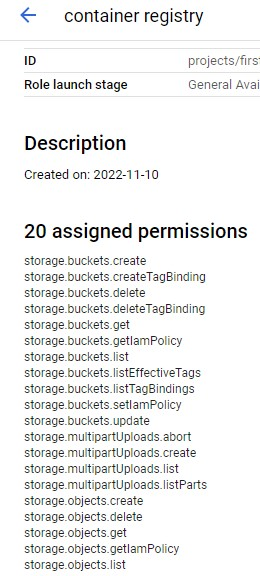
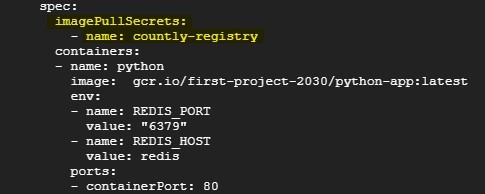
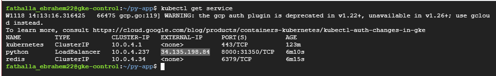
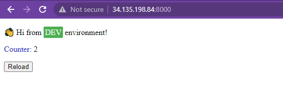

## Deployment files : 
* You can deploy them by using this command:
* kubectl apply -f .

## if you will pull your image from private container registry , user this secret resource on kubernates
kubectl create secret docker-registry countly-registry --docker-server=http://gcr.io --docker-username=_json_key --docker-password="$(cat key.json)"

where key.json is the key for service accout that have permission to access private container registry

and use it:
- in Spec Section 

## Get the external ip for python application
* kubectl get service 

* copy That IP and past it in your browser

