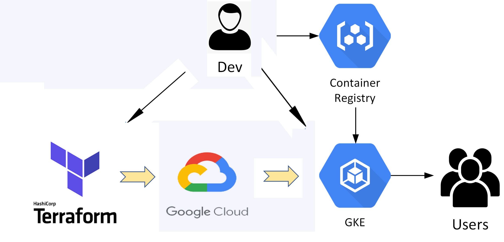

## General info
* 1- Building Infrastructure on GCP [ Google Cloud Platform ] Using Terraform 
* 2- Build Dockerfile for Python Application
* 3- Deploy Python Application On Private GKE [ Google Kubernetes Engine ] Cluster

*
