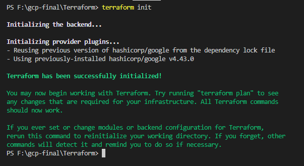
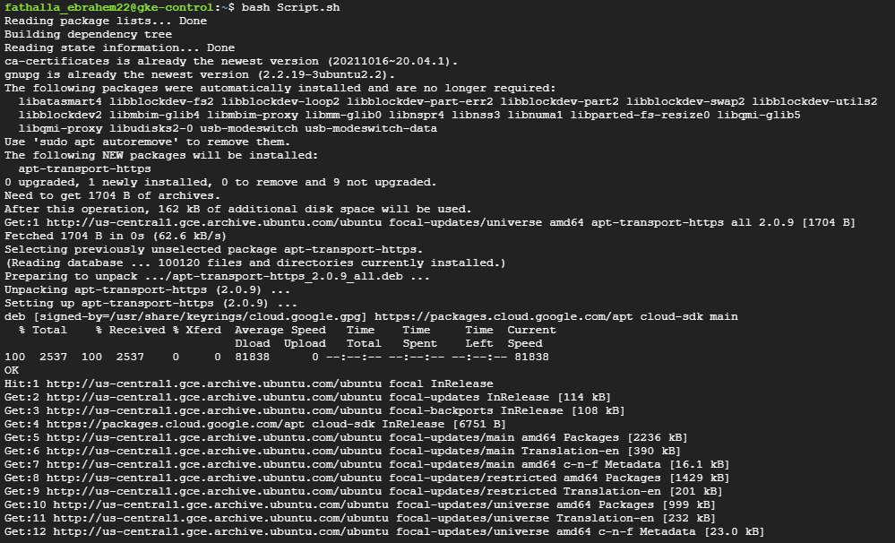

## Terraform code to build infrastucture on GCP [ Google Cloud Platform ] including the following:
* 1- Network [ VPC ] 
* 2- Firewalls
* 3- NAT and Router
* 4- Private GKE [ Google kubernetes Cluster ] 
* 5- Private Compute Engine [ VM ]

## Setup :
* 1- Initialize terraform code 

* 2- Apply terraform code 

* 3- SSh into VM and install [ gcloud , kubectl , activate Service account ] using  [ Script.sh ]

