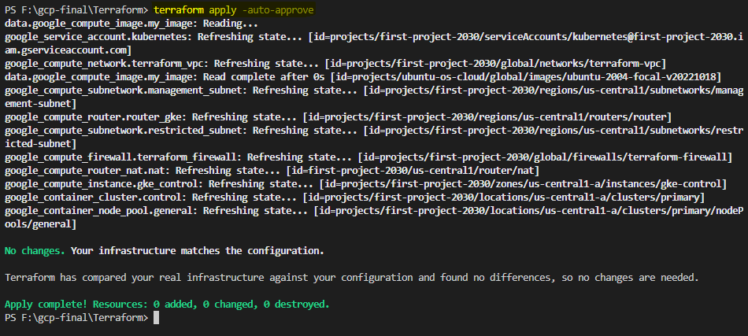
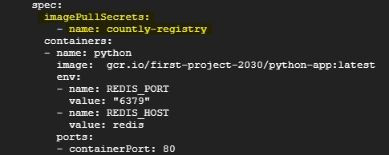

## Terraform code to build infrastucture on GCP [ Google Cloud Platform ] including the following:
* 1- Network [ VPC ] 
* 2- Firewalls
* 3- NAT and Router
* 4- Private GKE [ Google kubernetes Cluster ] 
* 5- Private Compute Engine [ VM ]

## Setup :
* 1- Initialize terraform code 

* 2- Apply terraform code 

* 3- SSh into VM and install [ gcloud , kubectl , activate Service account ] using  [ Script.sh ]

* 4- Connect to kubernetes cluster 

* 5- if you will pull your image from private container registry , user this secret resource on kubernates 

kubectl create secret docker-registry countly-registry --docker-server=http://gcr.io --docker-username=_json_key --docker-password="$(cat key.json)"

where key.json is the key for service accout that have permission to access private container registry

and use :
imagePullSecrets:
  - name: countly-registry
in Spec Section 

